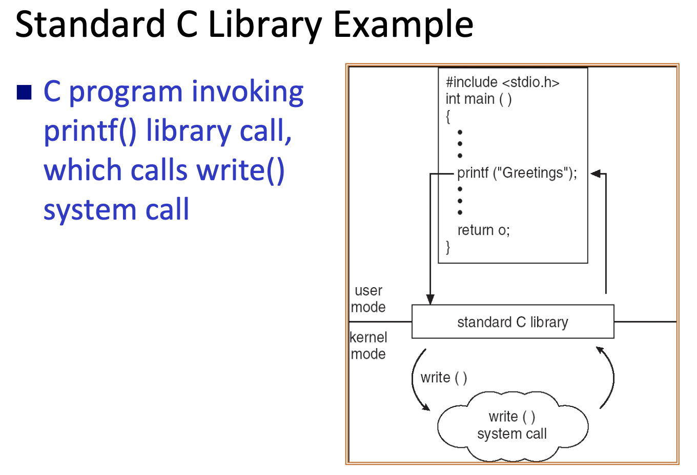

## **OS Services**

### **User Interface**
- CLI (Command Line Interface)
    - Shell: Command-line interpreter.(CSHELL,BASH) -> Adjusted according to user behavior and preference.
    - 能做得比GUI多（GUI建立在CLI上）
- GUI (Graphic User Interface)
- Most systems have both CLI and GUI.

### **Comunication Model**
- Message passing (memory copy)
    - read,write皆需經過system call
    - 缺點很慢
- Shared memory:
    - 藉由system call create shared memory的空間
    - 缺點deadlock、sychronization

## **OS-Application Interface**

### **System Call & API**
- System Call
    - request to the **kernal** via a **software interrupt**.
    - 使用**assembly-language** -> 講求效能
- API (Application Program Interface)
    - 使用language libraries, e.g.,**C Library**.
    - An API call could invove **zero or multiple system call**. 
    - ex.1 Both `malloc()` and `free()` use system call `brk()`(兩個不同的function call, call 同一個system call) 
    - ex.2 Ｍath API functions, such as `abs()`, don't need to invovle system call.
    
    - **Java API** -> Java virtual machine(**JVM**)
 - Why use API ? Simpicity, Portability, Efficiency. 

 ### **System Calls: Passing Parameter**(between a running program and the OS)
 - **Registers**.
 - Sent **pointer**.
 - Push onto the **stack**(memory 的一塊區域) by the program,and pop off the stack by OS.

## **OS Structure**

### **Simple OS Architecture**
- Cons: Unsafe,difficult to enhance.

### **Layered OS Architecture**
- layer N(user interface) ~ layer 0(hardware).
- 高階層可以使用低階層提供的服務。
- Pros: Easier debug.
- Cons: Less efficient.

 ### **Microkernal OS**
 - 把多數 kernal 的功能/內容模組化並移至 **user space**.
 - kernal 做 communicate. (**Message passing**)
 - Cons: 慢，一直 system call.

### **Modular OS Architecture**
- **Kernal modules**, 但仍全部都在 kernal.
    - Objected-oriented approach.
    - Each core component is separate.
    - Each is **loadable** as needed within the kernal.
- Similar to layers but with more flexible.

### **Virtual Machine**

